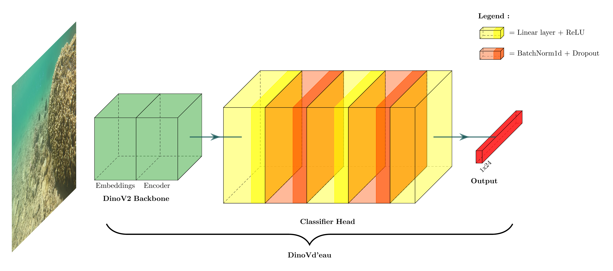

<p align="center">
  <a href="https://doi.org/10.5281/zenodo.15228874"></a>
  <a href="https://github.com/SeatizenDOI/DinoVdeau/graphs/contributors"></a>
  <a href="https://github.com/SeatizenDOI/DinoVdeau/network/members"></a>
  <a href="https://github.com/SeatizenDOI/DinoVdeau/issues"></a>
  <a href="https://github.com/SeatizenDOI/DinoVdeau/blob/master/LICENSE"></a>
  <a href="https://github.com/SeatizenDOI/DinoVdeau/pulls"></a>
  <a href="https://github.com/SeatizenDOI/DinoVdeau/stargazers"></a>
  <a href="https://github.com/SeatizenDOI/DinoVdeau/watchers"></a>
</p>

<div align="center">
  
  <p align="center">A classification framework to enhance underwater computer vision models.</p>
  <a href="https://github.com/SeatizenDOI/DinoVdeau">View framework</a>
  ·
  <a href="https://github.com/SeatizenDOI/DinoVdeau/issues">Report Bug</a>
  ·
  <a href="https://github.com/SeatizenDOI/DinoVdeau/issues">Request Feature</a>
  <h1></h1>
</div>

# DinoVd'eau: Underwater Multilabel Image Classification

This repository contains all necessary components for training and evaluating DinoVd'eau model, a deep learning model fine-tuned for underwater multilabel image classification. It leverages the dinov2 architecture and is customized for high precision in identifying diverse marine species.

A demo of the model can be found <a href="https://huggingface.co/spaces/lombardata/Victor_DinoVdEau_Image_Classification">here</a>.

It is a slightly adapted version of the original [DINOv2](https://arxiv.org/abs/2304.07193), GitHub [repository](https://github.com/facebookresearch/dinov2/).


## Project Structure

This repository is organized as follows to facilitate model training and evaluation:

```
.
├── config.json                         # General configuration for training parameters
├── main.py                             # Main script to start training and evaluation with command-line arguments for training
├── README.md                           # Project documentation and instructions
├── requirements.yml                    # Conda environment file to reproduce the project environment
└── src
    ├── data
    │   ├── data_loading.py             # Handles data loading
    │   └── data_preprocessing.py       # Preprocesses data for model input
    ├── model
    │   └── model_setup.py              # Sets up the model architecture and configuration
    └── utils 
        ├── evaluation.py               # Evaluation utilities for model performance
        ├── F1PerClassManager.py        # Manage to get the correct function to match the arguments.
        ├── model_card_generator.py     # Tools to generate model card on hugging face.
        ├── training.py                 # Utilities to facilitate the training process
        └── utils.py                    # General utilities for model card.
```

## Major Frameworks and Libraries

This section lists the key frameworks and libraries used to create the models included in the project:

* [](https://pytorch.org/) - A deep learning library used for constructing and training neural network models.
* [](https://scikit-learn.org) - Utilized for various machine learning tools for data mining and data analysis.
* [](https://huggingface.co/) - Provides thousands of pre-trained models to perform tasks on different modalities such as text, vision, and audio.

## Installation

To ensure a consistent environment for all users, this project uses a Conda environment defined in a `requirements.yml` file. Follow these steps to set up your environment:

1: **Clone the Repository** : First, clone the `DinoVd'eau` repository
```bash
git clone https://github.com/SeatizenDOI/DinoVdeau.git
cd DinoVdeau
```

2: **Create and Activate Conda Environment** : Next, create a Conda environment using the `requirements.yml` file and activate it
```bash
conda env create -f requirements.yml
conda activate dinovdeau_env
```

3: **Install PyTorch** : Finally, install PyTorch. It is recommended to install PyTorch with CUDA support for optimal performance. Follow the instructions [here](https://pytorch.org/get-started/locally/) to install PyTorch with the appropriate options for your system.

Here is an example command to install PyTorch with CUDA support:
```bash
pip install torch torchvision torchaudio --index-url https://download.pytorch.org/whl/cu118
```

4: **Create configiguration file** : At root folder, you need to create a config file called `config.json` with this parameters :
```json
{
  "ANNOTATION_PATH": "Path to annotation folder with you train.csv, val.csv, test.csv files",
  "IMG_PATH": "Path to images folder",
  "MODEL_PATH": "",
  "MODEL_NAME": "",
  "HUGGINGFACE_TOKEN": "YOUR API TOKEN",
  "LOCAL_MODEL_PATH": "/mnt/disk_victorlebos/data/datarmor/models/local_models/dinov2-large/"
}
```


By following these steps, you will set up the necessary environment to work with `DinoVd'eau`.

## Usage

To start the training process, navigate to the project root and execute:

```bash
python main.py [OPTIONS]
```

Where `[OPTIONS]` can include:

- `--image_size`: Specify the dimensions of input images.
- `--batch_size`: Define the batch size for training and validation.
- `--epochs`: Set the number of epochs for training.
- `--initial_learning_rate`: Initial learning rate for optimization.
- `--weight_decay`: Weight decay factor for the optimizer.
- `--early_stopping_patience`: Early stopping criterion based on validation loss.
- `--patience_lr_scheduler`: Patience for learning rate scheduler adjustments.
- `--factor_lr_scheduler`: Multiplicative factor for reducing the learning rate.
- `--model_name`: Path or identifier for the model to be used.
- `--freeze_flag`: Boolean to indicate if the model backbone should be frozen.
- `--data_aug_flag`: Boolean to enable or disable data augmentation.
- `--test_data_flag`: Boolean to test the workflow on a small subset of data, set to True to enable it.
- `--enable_web`: Boolean to enable the connection to the web, set to False to disable it.
- `--resume`: Boolean to resume training from the last checkpoint. If set to True, MODEL_NAME and MODEL_PATH must be provided in the config file.

## Team

DinoVd'eau is a community-driven project with several skillful people contributing to it.  
DinoVd'eau is currently maintained by [Matteo Contini](https://github.com/lombardata) with major contributions coming from [Alexis Joly](https://orcid.org/0000-0002-2161-9940), [Sylvain Bonhommeau](https://orcid.org/0000-0002-0882-5918), [Victor Illien](https://github.com/Gouderg), [César Leblanc](https://orcid.org/0000-0002-5682-8179), and the amazing people from the [Ifremer DOI Team](https://ocean-indien.ifremer.fr/) in various forms and means.

## Contributing

Contributions are welcome! To contribute, please follow these steps:

1. Fork the repository.
2. Create a new branch for your feature or fix.
3. Commit your changes with clear, descriptive messages.
4. Push your branch and submit a pull request.

## License

This framework is distributed under the CC0-1.0 license. See `LICENSE.txt` for more information.

## Citing DinoVd'eau

If you find this repository useful, please consider giving a star :star: and citation :fish::

```
@article{Contini2025,
   author = {Matteo Contini and Victor Illien and Mohan Julien and Mervyn Ravitchandirane and Victor Russias and Arthur Lazennec and Thomas Chevrier and Cam Ly Rintz and Léanne Carpentier and Pierre Gogendeau and César Leblanc and Serge Bernard and Alexandre Boyer and Justine Talpaert Daudon and Sylvain Poulain and Julien Barde and Alexis Joly and Sylvain Bonhommeau},
   doi = {10.1038/s41597-024-04267-z},
   issn = {2052-4463},
   issue = {1},
   journal = {Scientific Data},
   pages = {67},
   title = {Seatizen Atlas: a collaborative dataset of underwater and aerial marine imagery},
   volume = {12},
   url = {https://doi.org/10.1038/s41597-024-04267-z},
   year = {2025},
}
```


```
@misc{oquab2023dinov2,
  title={DINOv2: Learning Robust Visual Features without Supervision},
  author={Oquab, Maxime and Darcet, Timothée and Moutakanni, Theo and Vo, Huy V. and Szafraniec, Marc and Khalidov, Vasil and Fernandez, Pierre and Haziza, Daniel and Massa, Francisco and El-Nouby, Alaaeldin and Howes, Russell and Huang, Po-Yao and Xu, Hu and Sharma, Vasu and Li, Shang-Wen and Galuba, Wojciech and Rabbat, Mike and Assran, Mido and Ballas, Nicolas and Synnaeve, Gabriel and Misra, Ishan and Jegou, Herve and Mairal, Julien and Labatut, Patrick and Joulin, Armand and Bojanowski, Piotr},
  journal={arXiv:2304.07193},
  year={2023}
}
```
<div align="center">
  
</div>
